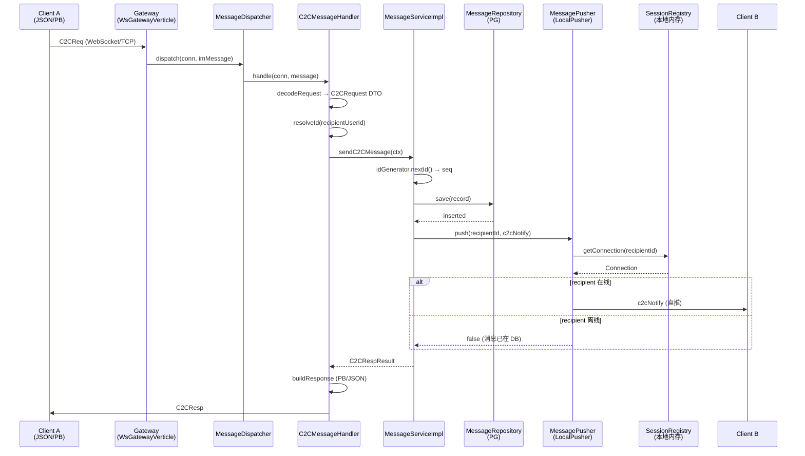
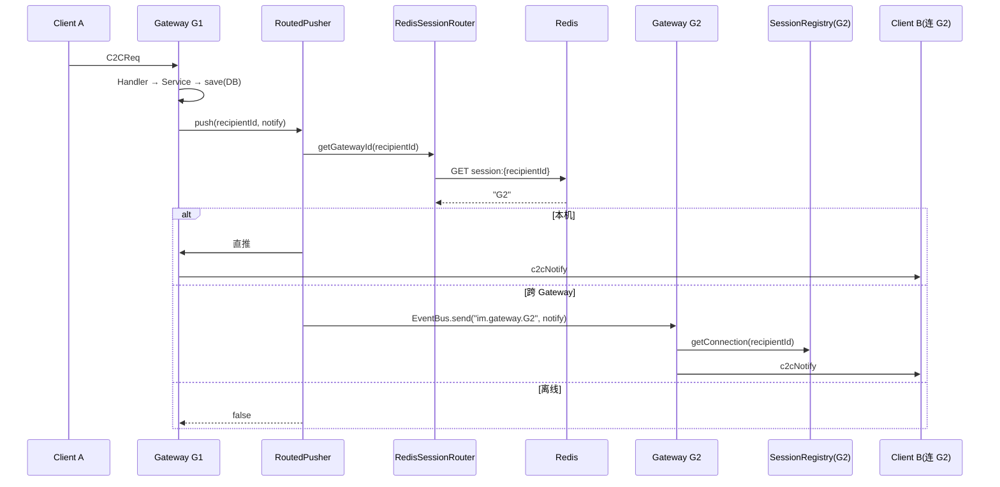
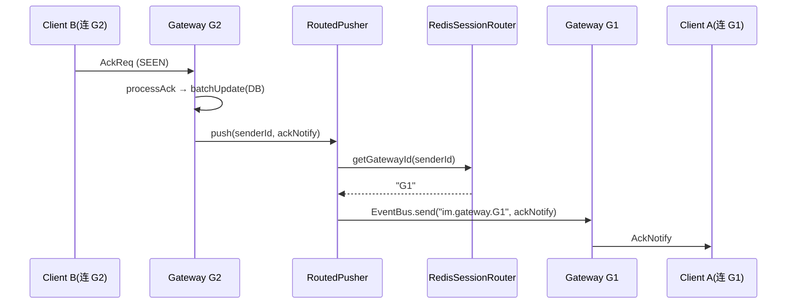

# 四层拆分实施计划

> 日期：2026-07-23
> 状态：草案
> 关联文档：
> - [消息可靠性方案设计](2026-07-17-message-reliability-design.md) — 第八章提出四层拆分方向
> - [Gateway/Logic 架构设计](gateway-logic-architecture.md) — 模块划分与部署拓扑
> - [Session 路由方案对比](session-routing-comparison.md) — Redis vs Hazelcast
> - [Redis Session 路由详细设计](session-routing-redis-design.md) — Key 结构与数据流

---

## 一、对原设计的分析

原设计（消息可靠性文档第八章）提出三步拆分：

| 阶段 | 动作 | 触发条件 |
|------|------|---------|
| 第一步 | Data 层独立 — DataServer Verticle，EventBus 通信 | DB 连接池需独立扩展 |
| 第二步 | Router 独立 — Session 信息迁 Redis，独立路由服务 | 多 Gateway 实例互相发现 |
| 第三步 | Logic 独立 — LogicServer 从 Gateway 拆出 | 业务逻辑需独立扩缩容 |

### 问题 1：拆分顺序与 IM 实际瓶颈不匹配

IM 系统的真实扩展瓶颈顺序是 **Gateway 连接数 → 路由发现 → 数据层 → 业务逻辑**。

原设计把 Data 放在第一步，但 Data 拆分后 Gateway 仍只能单实例，**连接数瓶颈没有解决**。Router 拆分才是 Gateway 水平扩展的前提，应排在第一位。

### 问题 2：Data 层用 EventBus 的延迟代价

当前消息链路是进程内调用（纳秒级）。Data 拆成独立 Verticle 后，每条消息的 DB 操作都要经过 EventBus 序列化 + 网络往返（毫秒级），对延迟敏感的 IM 场景代价显著。

Data 独立部署前，应先用 PgBouncer 做连接池复用，这是更低成本的方案。

### 问题 3：Logic 拆分的必要性存疑

Gateway 和 Logic 同进程时，消息处理是内存调用。拆成独立进程后变成网络调用，延迟增加 100-1000 倍。只有当 Logic 出现 CPU 密集型操作（内容审核、富文本处理）时才有拆分价值，当前纯消息转发场景不值得。

### 问题 4：缺失的关键设计

- 跨层消息格式：Gateway→Logic 传 `ImMessage`（二进制）还是 DTO？
- EventBus 集群发现：已引入 `vertx-hazelcast`，但未说明如何用它做 Gateway 间通信
- 连接迁移：Gateway 缩容时在线连接如何平滑迁移
- ACK 跨进程：三层确认机制在拆分后 AckNotify 如何跨 Gateway 送达发送方

---

## 二、调整后的实施路线

```
Phase 0 (当前)     代码分层 ✓ 已完成（MessageService / MessageRepository 接口已抽取）
Phase 1 (第一步)   Router 拆分 — Session 迁 Redis + Gateway 间转发
Phase 2 (条件触发)  Data 独立 — 先试 PgBouncer，不够再拆进程
Phase 3 (条件触发)  Logic 独立 — 仅当 Logic 出现 CPU 瓶颈
```

核心调整：**Router 提前到第一步**，Data 和 Logic 改为条件触发，不作为必做步骤。

---

## Phase 0：前置准备（现在就能做）

核心目标：为 Phase 1 路由拆分铺路，所有改动不影响现有功能。

### 0.1 新增 SessionRouter 接口

`SessionRegistry` 保持现状（内存存储本地连接的全部信息）。拆出独立的 **路由接口**：

```
SessionRouter (接口)
├── LocalRouter           ← Phase 0，直接返回本地 gatewayId（单机模式）
└── RedisSessionRouter    ← Phase 1 新增，查 Redis session:{userId} → gatewayId
```

**分工**：

| 组件 | 职责 | 存什么 |
|------|------|-------|
| `SessionRegistry` | 本机连接管理（不变） | `userId → Connection, id, userName, nickname, codec, token` |
| `SessionRouter` | 用户路由查询 | `userId → gatewayId`（Phase 1 存 Redis，Phase 0 返回本地） |

Redis 只存路由必需的最小字段：
```
session:{userId} → gatewayId  (TTL 300s 心跳续期)
```

### 0.2 新增 MessagePusher 接口

放在 Service 层，统一 Handler 和 Service 的推送入口：

```
MessagePusher (接口)
├── LocalPusher           ← Phase 0，查本地 SessionRegistry 直推
└── RoutedPusher          ← Phase 1，SessionRouter 路由 + 本地/EventBus 分发
```

```java
public interface MessagePusher {
    /** 推送消息到目标用户。在线则投递，离线返回 false */
    boolean push(long targetUserId, ImMessage message);
}
```

**调用关系**（Handler 通过 `AbstractMessageHandler` 间接获得，Service 层直接注入）：

```
C2CMessageHandler  → messageService.sendC2CMessage() → pusher.push()
AckReqHandler      → pusher.push()
FriendHandler      → pusher.push()
ApiVerticle        → pusher.push()
```

### 0.3 引入 gatewayId

`WsGatewayVerticle` / `TcpGatewayVerticle` 启动时生成 `hostname:port` 格式的唯一标识，存到 `SessionRouter`。

### 0.4 Ping 心跳续期

`PingHandler` 每次收到心跳，调 `SessionRouter.renew(userId)` 刷新 Redis TTL（Phase 0 实现为空，Phase 1 写 `EXPIRE session:{userId} 300`）。

### 验收标准

- 现有功能不变，所有测试通过
- `SessionRegistry` 对外接口不变（仅路由责任转移给 `SessionRouter`）
- 推送调用全部经过 `MessagePusher.push()`

---

## Phase 1：Router 拆分（核心步骤）

### 目标

让 Gateway 可以水平扩展，多实例间能互相转发消息。

> 详细设计参见 [Redis Session 路由详细设计](session-routing-redis-design.md)，本文档仅列实施要点。

### 改动清单

| 模块 | 改动 | 说明 |
|------|------|------|
| `SessionRegistry` | 内存 Map → Redis Hash | `session:{userId}` → `{gatewayId, connId, loginTime}`，TTL 300s 心跳续期 |
| 新增 `RouterService` | EventBus 地址寻址 | `im.gateway.{gatewayId}` 精准投递，`im.broadcast` 广播 |
| `WsGatewayVerticle` | 启动注册 gatewayId | Hazelcast 集群分配唯一 ID，EventBus 注册 consumer |
| `C2CMessageHandler` | 推送改走 `RoutedPusher` | 收件人不在本机 → EventBus 发到目标 Gateway |
| `AckReqHandler` | AckNotify 推送改走 `RoutedPusher` | 同上 |
| Login 流程 | 登录成功写 Redis session | Gateway 本地 + Redis 双写 |
| Logout / 断连 | 清理 Redis session | 删 `session:{userId}` + 从 `node:{gatewayId}:users` 移除 |

### 关键流程变化

```
当前:
  C2CReq → Handler → save(DB) → sessionRegistry.getConn(recipientId) → 本机直推

Phase 1:
  C2CReq → Handler → save(DB) → Redis 查 recipient 的 gatewayId
      ├─ 本机 → 直推（LocalPusher）
      └─ 其他 Gateway → EventBus.send("im.gateway.{targetGatewayId}", notify) → 目标 Gateway 投递
      └─ 不在线 → 跳过（消息已在 DB，等 Pull）
```

### Redis Key 设计（摘自路由详细设计）

```
session:{userId}        → String(JSON)  TTL 300s   用户→网关映射
node:{gatewayId}:users  → Set                      网关→在线用户集合（宕机清理）
```

### 宕机清理

Gateway 宕机时，`node:{gatewayId}:users` 中的用户 session 需要清理。两种策略：
- **被动清理**：session TTL 300s 自然过期（简单，有延迟）
- **主动清理**：Hazelcast membership listener 检测节点离开 → 批量删 session（实时，复杂）

Phase 1 先用被动清理，后续按需加主动清理。

### 验收标准

- [ ] 2 个 Gateway 实例，用户 A 连 G1、用户 B 连 G2，A 发消息 B 能收到
- [ ] 任一 Gateway 宕机，其用户重连到另一个 Gateway 后正常收发
- [ ] Session 注册/注销延迟 < 5ms（Redis 单次 RTT）
- [ ] 心跳续期正常，session 不在 5 分钟内过期

---

## Phase 2：Data 独立（条件触发）

### 触发条件

- DB 连接数 > 100，或
- PG 连接池成为瓶颈（`PgPoolFactory` maxSize=10 不够用）

### 第一步：PgBouncer（不拆进程）

部署 PgBouncer（transaction 模式），`PgPoolFactory` maxSize 从 10 降到 5。通常能解决 90% 的连接池问题。

### 第二步：DataServer Verticle（如果 PgBouncer 不够）

拆出独立 Verticle，暴露 EventBus 地址：

```
im.data.message.save          — 保存消息
im.data.message.updateStatus  — 更新状态
im.data.message.batchUpdate   — 批量更新
im.data.message.pullPending   — 拉取离线消息
im.data.message.findById      — 查询单条
```

消息体用 Protobuf 序列化（复用现有 Codec）。

### 验收标准

- [ ] PgBouncer 方案：连接数降低 80%+，功能不变
- [ ] DataServer 方案：Gateway 无直接 DB 依赖，DB 操作通过 EventBus

---

## Phase 3：Logic 独立（条件触发）

### 触发条件

- Logic 层出现 CPU 密集操作（内容审核、消息过滤、多媒体处理）

### 设计要点

> 详细设计参见 [Gateway/Logic 架构设计](gateway-logic-architecture.md)。

当前纯消息转发场景下，Logic 和 Gateway 同进程的延迟优势太大，**不建议当前阶段做**。

如果未来需要，关键决策点：
- 跨层消息格式：用 `ImMessage` 二进制透传还是 DTO 序列化
- Logic Server 无状态化：所有状态（session、连接）留在 Gateway
- 推送链路：Logic → Redis 查路由 → EventBus → 目标 Gateway（复用 Phase 1 的 RouterService）

---

## 六、消息收发流程

### Phase 0：单 Gateway（当前目标架构）



### Phase 1：多 Gateway + 路由



### ACK Notify 跨 Gateway



---

## 七、Phase 0 任务拆分

### Task 1：新增 `SessionRouter` 接口 + 实现

**文件**：
- 新建 `src/main/java/com/github/moxib/pomelo/gateway/router/SessionRouter.java` — 接口
- 新建 `src/main/java/com/github/moxib/pomelo/gateway/router/LocalRouter.java` — Phase 0 实现

**接口定义**：
```java
public interface SessionRouter {
    String getGatewayId(String userId);      // 查用户所在 Gateway
    void register(String userId);            // 注册路由（Phase 0 存 gatewayId 到内存）
    void unregister(String userId);          // 注销路由
    void renew(String userId);               // 心跳续期（Phase 0 no-op）
    String getLocalGatewayId();              // 获取当前节点 gatewayId
}
```

**LocalRouter 实现**：`ConcurrentHashMap<String, String>` + gatewayId 常量。

**改动**：
- `WsGatewayVerticle.start()` — 生成 `gatewayId = hostname:port`，传给 `LocalRouter`
- `LoginHandler.completeLogin()` — 调 `sessionRouter.register(userId)`
- `LogoutHandler.handle()` — 调 `sessionRouter.unregister(userId)`
- `WsGatewayVerticle` 断连回调 — 调 `sessionRouter.unregister(userId)`

### Task 2：新增 `MessagePusher` 接口 + `LocalPusher` 实现

**文件**：
- 新建 `src/main/java/com/github/moxib/pomelo/gateway/push/MessagePusher.java` — 接口
- 新建 `src/main/java/com/github/moxib/pomelo/gateway/push/LocalPusher.java` — Phase 0 实现

**LocalPusher 核心逻辑**：
```java
public boolean push(long targetUserId, ImMessage message) {
    Connection conn = sessionRegistry.getConnection(targetUserId);
    if (conn == null) return false;
    conn.write(message.encodeToWire());
    return true;
}
```

### Task 3：迁移推送调用到 `MessagePusher`

**涉及文件**：

| 文件 | 改动 |
|------|------|
| `MessageServiceImpl.pushToRecipient()` | `sessionRegistry.getConnection(recipientId)` + `conn.write()` → `messagePusher.push(recipientId, notify)` |
| `AckReqHandler.pushAckNotify()` | 同上 → `messagePusher.push(ctx.getSenderId(), ackNotify)` |
| `FriendHandler.pushNotify()` | 同上 → `messagePusher.push(targetUserId, notify)` |
| `ApiVerticle` | 如有推送逻辑，同样改造 |

### Task 4：注入链路更新

**`MessageDispatcher`** 构造时创建并注入：
```java
this.sessionRouter = new LocalRouter(gatewayId);
this.messagePusher = new LocalPusher(sessionRegistry, sessionRouter);
```

**`AbstractMessageHandler`** 新增字段 `messagePusher`，所有 Handler 通过基类获得。

**`MessageServiceImpl`** 构造函数新增 `messagePusher` 参数。

### Task 5：`PingHandler` 心跳续期

每次收到 Ping → `sessionRouter.renew(userId)`。Phase 0 实现为空方法。

### 验收

- [ ] 编译通过，现有测试全部通过
- [ ] 单实例启动，C2C 消息收发正常
- [ ] `SessionRegistry` 对外 API 不变（只增加 `SessionRouter`，不修改 `SessionRegistry`）

如果未来需要，关键决策点：
- 跨层消息格式：用 `ImMessage` 二进制透传还是 DTO 序列化
- Logic Server 无状态化：所有状态（session、连接）留在 Gateway
- 推送链路：Logic → Redis 查路由 → EventBus → 目标 Gateway（复用 Phase 1 的 RouterService）

---

## 四、技术选型确认

| 组件 | 选型 | 理由 |
|------|------|------|
| 集群发现 | Hazelcast（已引入 `vertx-hazelcast`） | EventBus 集群通信开箱即用 |
| Session 存储 | Redis（已有 `RedisFactory`） | 低延迟、TTL 原生支持 |
| 跨 Gateway 通信 | EventBus clustered | 精准投递 `send` + 广播 `publish` |
| DB 连接池优化 | PgBouncer | 进程外连接复用，无需改代码 |

---

## 五、风险与注意事项

1. **EventBus 消息大小限制**：默认 1MB，大消息（如群发）需考虑分片或走旁路
2. **Redis 单点风险**：Phase 1 依赖 Redis 做路由，Redis 不可用 = 无法跨 Gateway 投递。需确保 Redis 高可用（Sentinel/Cluster）
3. **Session 一致性**：双写（本地 + Redis）场景下，网络分区可能导致不一致。以本地 SessionRegistry 为准，Redis 仅用于路由查询
4. **灰度方案**：Phase 1 上线时先单 Gateway 部署验证，再逐步加实例
