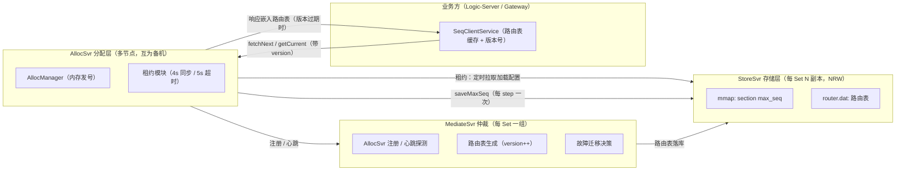
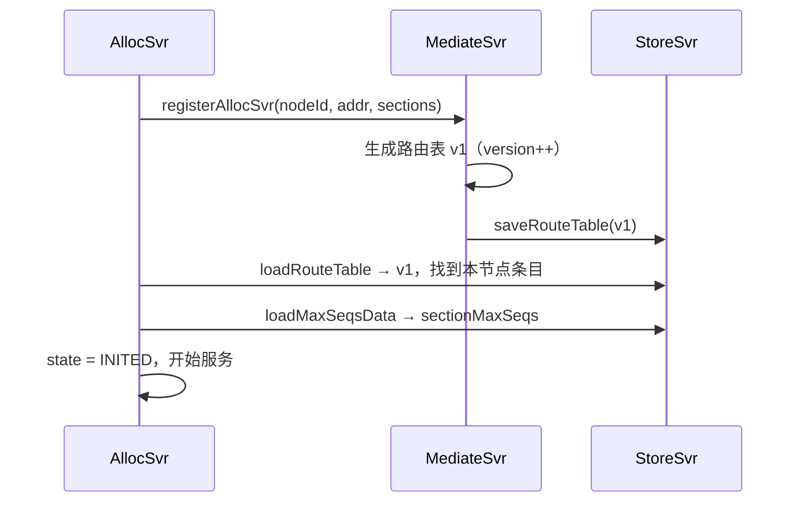
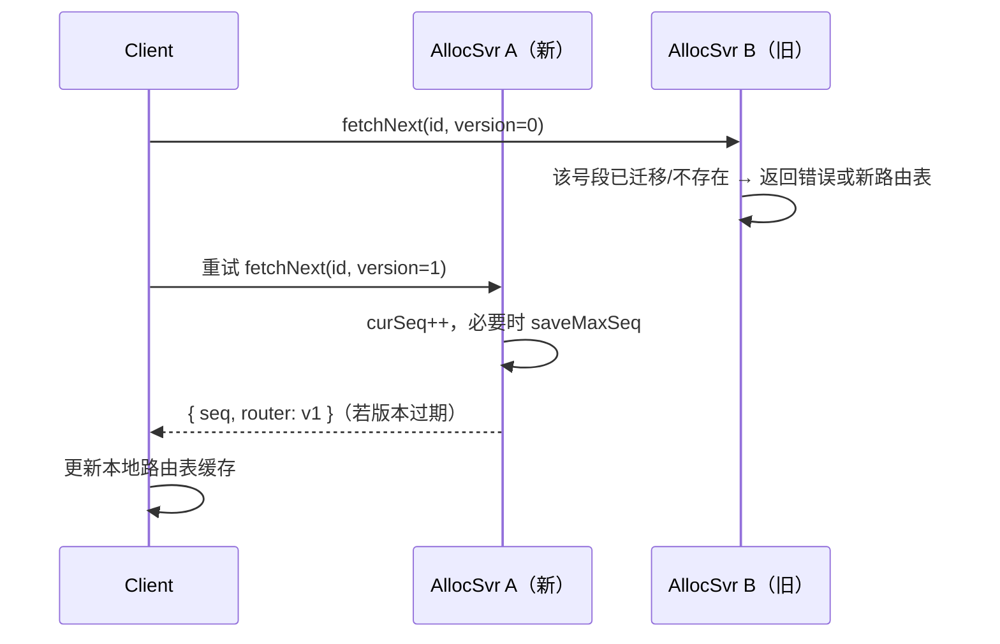
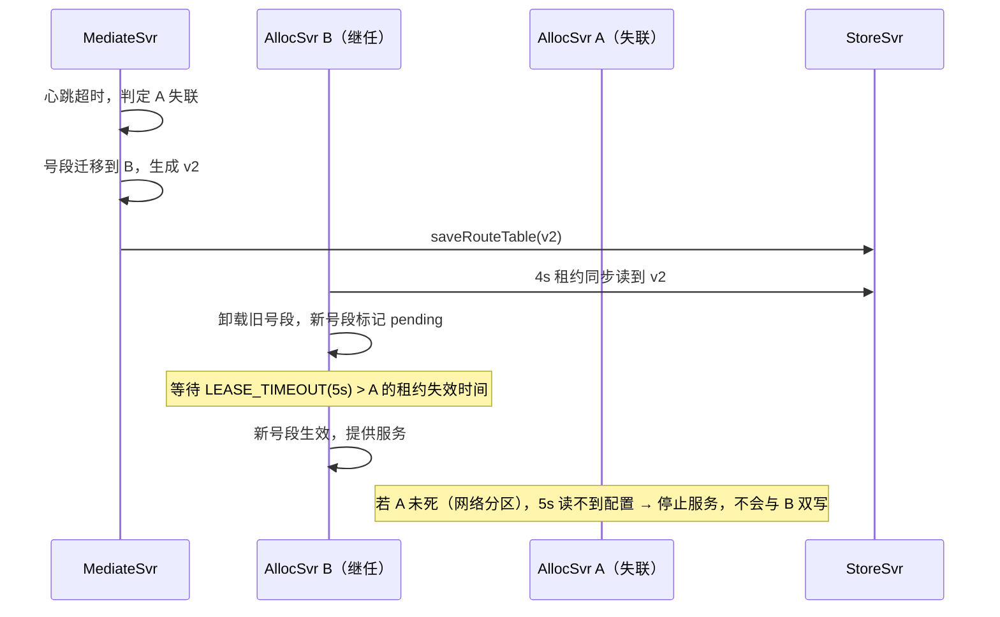

# seqsvr Vert.x 实现方案

> 日期：2026-08-01
> 状态：草案
> 依据：
> - 文章：《万亿级调用系统：微信序列号生成器架构设计及演变》（微信后台团队 / InfoQ，2016）
> - 参考实现：`/Users/user/code/seqsvr`（uidgen/seqsvr，Go，go-zero + gRPC）
> - 现有代码：`pomelo-seqsvr-client` / `pomelo-seqsvr-server`（Vert.x 5.1.5 + Java 17）

---

## 一、文章核心思想回顾

seqsvr 为微信每份需要同步的数据生成**递增的 64 位版本号（sequence）**，每个用户拥有独立的 sequence 空间。要求：递增不回退；平均耗时 1ms、99.9% < 3ms；每日万亿级调用。

### 1.1 三个核心策略

**策略 A：预分配中间层（号段式）**

只要求递增、不要求连续，因此引入 `cur_seq`（最近分配出去的序号）与 `max_seq`（分配上限）：

1. 分配时 `cur_seq++`，与 `max_seq` 比较；
2. 若 `cur_seq > max_seq`，则 `max_seq += step`（步长 10000），并**持久化 max_seq**；
3. 重启时读持久化的 `max_seq` 赋给 `cur_seq`。

效果：磁盘 IO 从 ~10^7 QPS 降到 ~10^3 QPS。代价：重启后首次分配会出现一个不超过 step 的跳跃（允许）。

**策略 B：分号段共享存储（Section）**

uid 相邻的 10 万个用户属于一个 Section，**同 Section 内用户共享一个 max_seq**。全量 2^32 uid 若每用户 8 字节需要 32GB，分 Section 后单 Section 仅 300+KB，重启加载可行。

**策略 C：工程分层**

- **StoreSvr**（存储层）：持久化 max_seq 与路由表，多机 NRW 策略保证不丢数据；
- **AllocSvr**（分配层/缓存中间层）：每台负责若干号段，内存发号，分摊海量请求；
- **分 Set**：按 uid 范围划分，每个 Set 是独立的 StoreSvr+AllocSvr 子系统，做灾难隔离。

### 1.2 容灾设计

**核心约束**：任意时刻任意 uid 有且仅有一台 AllocSvr 提供服务 → sequence 递增不回退。

- **仲裁服务（Mediate）**：探测 AllocSvr 状态，生成"号段 → AllocSvr"加载配置；不直接操作 AllocSvr，而是**写入 StoreSvr 持久化**，AllocSvr 定期读取。
- **租约机制**：
  - 租约失效：AllocSvr N 秒内读不到加载配置 → 停止服务；
  - 租约生效：读到新配置后，立即卸载被收回的号段，新号段等待 N 秒后再服务；
  - 保证切换时新 AllocSvr 严格晚于旧 AllocSvr 下线。
- **容灾 1.0 主备**：一主一备，Client 最多一次试探请求即可找到正确的 AllocSvr。缺陷：备机闲置一半、切换瞬时过载、扩容缩容需同步配置文件。
- **容灾 2.0 嵌入式路由表**（关键转折）：统一路由表（uid 号段 → AllocSvr 全映射）由仲裁生成 → 写 StoreSvr → AllocSvr 租约读出 → **嵌入 sequence 响应包旁路给 Client**。Client 缓存路由表 + 版本号，请求携带版本号；服务端发现版本过期则在响应中附带最新路由表；Client 更新后重试。由此实现所有机器互为备机、故障号段均匀迁移、负载均衡、免配置文件运维。

---

## 二、Go 参考实现分析

### 2.1 模块划分

| 模块 | 职责 | 关键文件 |
|------|------|---------|
| `proto/seqsvr` | TL 协议定义、常量、类型 | `vars.go`、`section.go`、`set.go`、`seqsvr.tl.pb.go` |
| `store` | 存储层，mmap 文件持久化 | `dao/store.go`（StoreManager） |
| `alloc` | 分配层，内存发号 + 租约 | `dao/alloc.go`（AllocManager）、`dao/lease.go`（Lease） |
| `mediate` | 仲裁层（开源版被 license 阻止，仅留接口） | `core/mediate.registerAllocSvr_handler.go` 等 |
| `client` | 各服务客户端（go-zero zrpc） | `alloc/client`、`store/client` |

### 2.2 关键常量与算法

```
MaxIDSize        = 0xffffffff       // 生产：uint32 整个空间
DebugMaxIDSize   = 1 << 20          // 调试：1MB
SeqStep          = 10000            // 预分配步长
PerSectionIdSize = 100000           // 每个 Section 包含的 uid 数
MaxSectionSize   = MaxIDSize / PerSectionIdSize + 1
```

**StoreSvr**（`StoreManager`）：
- 文件 `set_{idBegin}_{size}.db`：mmap，每 section 8 字节存 max_seq，按 set 维度计算 section 索引；
- 文件 `router_{idBegin}_{size}.dat`：JSON 路由表；
- RPC：`store.loadMaxSeqsData` / `store.saveMaxSeq` / `store.loadRouteTable` / `store.saveRouteTable`；
- `SetMaxSeq`：仅当新值更大时更新，并**向上取整到 step 边界**。

**AllocSvr**（`AllocManager`）：
- 状态机：`allocNone → allocWaitRouteTable → allocWaitLoad → allocWaitLoadSeq → allocInited → allocError`；
- `LoadMaxSeq`：从 StoreSvr 拉取本 Set 全部 section 的 max_seqs，展开为每 uid 的 curSeqs；
- `FetchNextSequence(id, clientVersion)`：`curSeqs[id]++`；若 `seq > sectionMaxSeqs[sectionIdx]` 则 `SaveMaxSeq` 持久化且内存 `sectionMaxSeqs += SeqStep`；若 `clientVersion < router.version` 则响应附带路由表；
- `GetCurrentSequence(id, clientVersion)`：只读当前值，同样附带过期路由表；
- **租约**：`LeaseTimeOut=5s`、`SyncLeaseTimeout=4s`（定时同步路由）、`CheckLeaseTimeout=1s`；回调 `OnLeaseValid / OnLeaseUpdated / OnLeaseInvalid`。开源版仅有骨架，未完整接线。

**MediateSvr**：开源版 `registerAllocSvr / unRegisterAllocSvr` 均被 license 阻止，仲裁逻辑需自行实现。

### 2.3 参考实现中的已知问题（移植时需修正）

1. `OnMaxSeqLoaded` 展开循环边界错误：`for j := i*PerSectionIdSize; j < PerSectionIdSize; j++`，i ≥ 1 时循环体不执行，多 Section 时 curSeqs 后半部分恒为 0（单机单 Section 演示不受影响）。
2. `curSeqs` 为稠密数组（每 uid 8 字节），生产全量空间需数百 GB，不可直接照搬。
3. `SaveMaxSeq` 的返回值（Store 对齐后的值）未被使用，AllocSvr 内存中直接 `+= SeqStep`，两者在并发/异常路径下可能不一致。
4. Lease 骨架未接线到状态机与路由加载，`AllocManager` 启动即 `Inited`，缺少租约失效保护。

---

## 三、现有 Vert.x 代码盘点（pomelo 仓库）

### 3.1 已完成

| 模块 | 文件 | 状态 |
|------|------|------|
| proto 类型 | `pomelo-seqsvr-client/.../proto/`：`RangeId`、`Router`、`RouterNode`、`Sequence`、`AllocState`、`SeqSvrConstants` | ✅ |
| StoreManager | `pomelo-seqsvr-server/.../store/StoreManager.java`：mmap 文件 + 路由表 JSON，对齐 step 持久化 | ✅ |
| AllocManager | `pomelo-seqsvr-server/.../alloc/AllocManager.java`：核心发号算法，**稀疏 curSeqs（Map<Integer,Long>）**，惰性起步，路由版本判断 | ✅ |
| 服务入口 | `SeqAllocVerticle`：EventBus consumer（`seqsvr.alloc.fetchNext` / `seqsvr.alloc.getCurrent`） | ✅ |
| 客户端 SDK | `SeqClientService`：EventBus 调用、路由表缓存 + 版本号、`toSectionId` 哈希映射 | ✅ |
| 测试 | `AllocManagerTest`、`StoreManagerTest`、`SeqAllocVerticleTest`、`SeqClientServiceTest` | ✅ |

### 3.2 待补齐（本文档方案主体）

- StoreSvr / AllocSvr / MediateSvr 三服务拆分（当前 Store 内嵌于 Alloc 单进程）；
- 租约机制与状态机完整化；
- MediateSvr 仲裁服务（注册、心跳、路由表生成、号段迁移）；
- 多节点部署与容灾（跨进程通信、客户端重试）；
- 存储层 NRW 多副本。

---

## 四、目标架构

### 4.1 总体架构



### 4.2 模块划分（Maven）

```
pomelo-seqsvr
├── pomelo-seqsvr-client          # SDK + 协议类型（已有）
├── pomelo-seqsvr-store           # StoreSvr 独立进程（新增）
├── pomelo-seqsvr-alloc           # AllocSvr 独立进程（由 server 演进）
├── pomelo-seqsvr-mediate         # MediateSvr 仲裁（新增）
└── pomelo-seqsvr-server          # 开发模式单进程（保留，演进为 AllocSvr）
```

每个服务一个可执行入口（`*Main`），继承现有 `ClusterHelper.createVertx()` 模式（单机非集群 / Hazelcast 集群可切换）。

### 4.3 通信方式选择

| 通道 | 用途 | 方案 |
|------|------|------|
| 业务 → Alloc | 发号高频路径（10^5~10^7 QPS） | 开发模式：本地 EventBus；生产：**TCP 长连接自定义协议**（参考 Go gRPC，但发号路径应避免 Hazelcast 集群 EventBus 的序列化与延迟开销） |
| Alloc → Store | saveMaxSeq（低频，每 step 一次）+ 租约读表（4s 一次） | 集群 EventBus 或 HTTP，先 EventBus 保持简单 |
| Mediate → Store | 路由表读写 | 同上 |
| Alloc → Mediate | 注册 / 心跳（秒级） | 同上 |

### 4.4 端口约定（沿用 Go）

| 服务 | 端口 |
|------|------|
| AllocSvr | 10100 |
| StoreSvr | 10102 |
| MediateSvr | 10106 |

---

## 五、数据模型与 RPC 协议

### 5.1 核心类型（已有，保持）

```
RangeId    { int idBegin; int size; }          // SetID / SectionID 复用
Router     { int version; List<RouterNode> nodeList; }
RouterNode { String nodeId; String ip; int port; List<RangeId> sectionRanges; }
Sequence   { long seq; Router router; }         // router 仅版本过期时携带
AllocState { NONE, WAIT_ROUTE_TABLE, WAIT_LOAD, WAIT_LOAD_SEQ, INITED, ERROR }
```

### 5.2 RPC 接口（对齐 Go，消息体为 JsonObject / 序列化 DTO）

**StoreSvr**：

| 方法 | 请求 | 响应 |
|------|------|------|
| `store.loadMaxSeqsData` | - | `{ setId, maxSeqs: long[] }` |
| `store.saveMaxSeq` | `{ id, maxSeq }` | `{ v }`（对齐后的新 max_seq） |
| `store.loadRouteTable` | - | `Router` |
| `store.saveRouteTable` | `Router` | `bool` |

**AllocSvr**：

| 方法 | 请求 | 响应 |
|------|------|------|
| `alloc.fetchNextSequence` | `{ id, version }` | `{ seq, routeVersion?, router? }` |
| `alloc.getCurrentSequence` | `{ id, version }` | 同上（不递增） |

**MediateSvr**：

| 方法 | 请求 | 响应 |
|------|------|------|
| `mediate.registerAllocSvr` | `RouterNode`（声明要服务的号段） | `bool` |
| `mediate.unRegisterAllocSvr` | `RouterNode` | `bool` |
| `mediate.heartbeat` | `{ nodeId, load, sections }` | `bool`（可选，用于负载均衡） |

---

## 六、详细设计

### 6.1 StoreSvr（存储层）

**职责**：持久化 section max_seq + 路由表，向 AllocSvr / MediateSvr 提供 4 个 RPC。

**单副本实现（沿用现有 StoreManager）**：
- mmap 文件 `set_{idBegin}_{size}.db`，每 section 8 字节（LITTLE_ENDIAN）；
- 首次创建截断到 `sectionCount << 3` 并清零 + `force()`；
- `setSectionMaxSeq`：仅当新值更大时写入，向上取整到 `SEQ_STEP` 边界，`force()` 落盘；
- 路由表 `router_{idBegin}_{size}.dat`：JSON，写文件 + 内存缓存。

**多副本 NRW（生产）**：
- 同一 Set 部署 M 个 StoreSvr 副本（M ≥ 3）；
- 写：`saveMaxSeq` 需 W 个副本确认（W ≥ 2）；读：`loadMaxSeqsData` 从 R 个副本读取取各 section 最大值（R ≥ 2）；
- 由于租约保证同一 section 任意时刻只有一个写入者，副本间不存在并发写冲突，max 合并即正确；
- 通信：集群 EventBus 广播或点对点请求，`request` 带超时。

**事件循环注意**：`MappedByteBuffer` 的写是直接内存写（快），`force()` 是阻塞 msync。写路径每 step（10000 次发号）才一次，频率低可接受；若追求极致，可把 `force()` 丢到 worker 线程池异步执行，配合周期性定时 force。

### 6.2 AllocSvr（分配层）

**状态机（完整化）**：

```
NONE ──注册到 Mediate──▶ WAIT_ROUTE_TABLE ──加载路由表──▶ WAIT_LOAD
      ──加载 max_seqs──▶ WAIT_LOAD_SEQ ──就绪──▶ INITED
      ──任何一步失败/租约失效──▶ ERROR（停止发号）
```

**启动流程**：
1. 向 MediateSvr 注册本节点（nodeId、ip:port、声明号段）；
2. 从 StoreSvr 加载路由表，找到本节点条目 → `cacheMyNode`；
3. 从 StoreSvr 加载本 Set 的 `maxSeqs`，存入 `sectionMaxSeqs`，快照 `baseSectionMaxSeqs`（新 id 的惰性起步值，等价修复 Go 的展开 bug）；
4. 状态 → INITED，开始服务。

**发号算法（沿用现有 AllocManager，稀疏 curSeqs）**：

```
fetchNextSequence(id, clientVersion):
  校验 state == INITED 且 id 落在本节点 sectionRanges
  sectionIdx = (id - setId.idBegin) / SECTION_SIZE
  curSeq = curSeqs.getOrDefault(id, baseSectionMaxSeqs[sectionIdx]) + 1
  curSeqs.put(id, curSeq)
  if curSeq > sectionMaxSeqs[sectionIdx]:
      store.saveMaxSeq(id, curSeq)            // 持久化（对齐由 Store 完成）
      sectionMaxSeqs[sectionIdx] += SEQ_STEP  // 内存提升
  seq = { curSeq }
  if clientVersion < router.version:
      seq.router = router                     // 嵌入式路由表
  return seq
```

**线程模型**：AllocManager 只被 AllocVerticle 的事件循环线程访问（EventBus consumer 天然串行），`curSeqs` HashMap 无需加锁；路由表更新（租约回调）也须投递到同一事件循环（`vertx.runOnContext` / 直接在同一 context 内执行），避免 volatile 读写的可见性问题。

**租约模块（新增，对齐 Go 常量）**：
- 周期定时器：每 `CHECK_LEASE_TIMEOUT = 1s` 检查；
- 每 `SYNC_LEASE_TIMEOUT = 4s` 从 StoreSvr 拉取路由表：
  - 路由表版本变化 → `OnLeaseUpdated`：**立即卸载**本节点不再拥有的号段（从 `curSeqs` 剔除对应区间，停止服务该区间请求）；
  - 新增号段 → 标记 `pendingSections`，等待 `LEASE_TIMEOUT = 5s` 生效（保证旧 AllocSvr 已停止）；
- 连续超过 `LEASE_TIMEOUT = 5s` 无法读取 StoreSvr → `OnLeaseInvalid`：状态置 ERROR，**拒绝一切发号请求**（防止脏数据）。

**saveMaxSeq 结果处理（修复 Go 问题 3）**：以 Store 返回的对齐值回填 `sectionMaxSeqs[sectionIdx]`，不再自行 `+= SEQ_STEP`，避免与持久化值分叉。

### 6.3 MediateSvr（仲裁层，新增）

**职责**：维护"号段 → AllocSvr"全映射路由表，驱动容灾与负载均衡。

**数据**：内存持有当前路由表（version 自增），持久化到本 Set 的 StoreSvr（`store.saveRouteTable`）。

**注册与心跳**：
- AllocSvr 启动时 `registerAllocSvr`（声明 nodeId / addr / 期望号段）；Mediate 将其加入节点池并重新生成路由表（version++）；
- AllocSvr 每秒心跳；Mediate 维护 `lastSeen`，超过阈值（如 3 × 心跳周期）判定失联。

**故障迁移**：
1. 失联节点上的号段按"均匀分摊"策略迁移到其他存活节点；
2. 生成新路由表（version++）→ 写 StoreSvr；
3. 等待一个租约周期（≥ 5s），确保旧节点已停止服务（租约失效）后，将新路由表生效（该等待由 AllocSvr 侧的"新号段等待 N 秒"机制完成，Mediate 只需正常写表）；
4. 客户端在下一次请求时收到新路由表，自动收敛。

**负载均衡（可选增强）**：心跳携带各节点 load（QPS / 延迟），Mediate 定期把高负载节点的号段拆分迁移，实现文章所述的"互为备机 + 负载均衡"。

**运维接口**：`unRegisterAllocSvr`（优雅下线）、admin HTTP 接口（手动迁移号段 / 查看路由表），解决文章所述"扩容缩容免改配置文件"。

### 6.4 Client SDK（业务方）

**已有能力**：EventBus 调用、`routeVersion` + `cacheRouter` 缓存、响应路由表更新、`toSectionId` 确定性哈希（修复 snowflake 截断负数问题）。

**补齐（对应文章"路由同步优化"四步）**：
1. 本地缓存路由表 → 按 `sectionRanges` 匹配目标 AllocSvr；无路由表时**随机选择**一台；
2. 请求携带本地 `version`；
3. 收到响应：若带 `router` 且版本更新 → 更新缓存；
4. 若本次请求的节点**不拥有该号段**（服务端返回 `invalid id` 或路由已更新）→ 用新路由表**重试一次**（最多一次，避免重试风暴）。

**多节点传输**：`SeqClientService` 底层从"本地 EventBus"抽象出 `SeqTransport` 接口：

```
SeqTransport (接口)
├── LocalEventBusTransport   ← 开发模式 / 同进程
└── TcpTransport             ← 生产：长连接 + 长度前缀帧（复用 RecordParser 模式）
```

发号协议帧：`{ cmd: fetchNext|getCurrent, id, version } → { seq, routeVersion?, router? }`，Protobuf 或紧凑二进制。

---

## 七、关键时序

### 7.1 AllocSvr 启动



### 7.2 发号（含路由收敛）



### 7.3 故障迁移（租约保证无回退）



---

## 八、性能设计

| 手段 | 说明 |
|------|------|
| 事件循环亲和 | 发号路径零锁：curSeqs / sectionMaxSeqs 只被单一事件循环访问；路由表更新投递回同一 context |
| 稀疏 curSeqs | `Map<Integer, Long>` 只物化活跃 id，支持完整 int id 空间（Go 稠密数组需数百 GB，不可行） |
| 批量预分配 | 每 uid 的 `max_seq` 一次提升 10000，写 Store 频率 = 发号频率 / 10000 |
| mmap 直写 | 内存直接写 + 低频 `force()`；高负载下异步 msync |
| 异步全链路 | Vert.x 非阻塞：EventBus / TCP 调用无阻塞等待；StoreSvr 读写均为内存/mmap 操作 |
| 路由表旁路 | 仅在版本过期时携带 Router，正常响应零额外开销（对齐文章"避免带宽消耗"） |
| 协议最小化 | 发号请求 `{int32 id, int32 version}` 固定 8 字节头，避免 JSON 序列化开销（生产 TcpTransport） |

目标：单 4 核实例 ≥ 10 万 QPS（发号路径纯内存操作），跨节点 saveMaxSeq 每 10000 次才一次，不成为瓶颈。

---

## 九、与 Go 实现的差异及移植注意点

| # | 差异 | 处理 |
|---|------|------|
| 1 | Go curSeqs 稠密数组（全空间数百 GB） | Java 稀疏 Map（已完成） |
| 2 | Go `OnMaxSeqLoaded` 展开循环 bug | 惰性起步：`baseSectionMaxSeqs[sectionIdx]` 快照（已完成） |
| 3 | Go `SaveMaxSeq` 返回值未回填 | 以 Store 对齐返回值回填 sectionMaxSeqs |
| 4 | Go Lease 未接线 | 完整实现：4s 同步 / 5s 超时 / 1s 检查 / pending 号段延迟生效 |
| 5 | Go mediate 被 license 阻止 | 自行实现仲裁逻辑（注册、心跳、迁移、路由表生成） |
| 6 | Go 用 gRPC | Vert.x：EventBus（开发）+ 自研 TCP（生产），复用 pomelo `RecordParser` 粘包处理模式 |
| 7 | Go 单进程演示 | Maven 多模块独立进程，`ClusterHelper` 切换单机/集群 |

---

## 十、实施路线

### Phase 0：现状固化（已完成）
- 稀疏 curSeqs、惰性起步、路由版本旁路、mmap StoreManager、EventBus 服务化、客户端 SDK + 单测。

### Phase 1：StoreSvr 独立服务化
- 新建 `pomelo-seqsvr-store`：将 StoreManager 包装为独立 Verticle，暴露 4 个 RPC（EventBus 地址 `seqsvr.store.*`）；
- AllocSvr 改为通过 StoreClient 调用，不再直接持有 StoreManager；
- 验收：单机启动 store + alloc 两进程，发号测试通过，重启后 sequence 不回退。

### Phase 2：租约机制与状态机完整化
- AllocManager 接入定时器：4s 路由同步、5s 超时判定、pending 号段延迟生效；
- 状态机全路径（含 ERROR 停止服务）；
- saveMaxSeq 返回值回填；
- 验收：单测覆盖租约失效停止服务、号段卸载/延迟加载；集成测试模拟 StoreSvr 不可用。

### Phase 3：MediateSvr 仲裁
- 注册 / 心跳 / 路由表生成（version 管理）与持久化；
- AllocSvr 启动注册 + 心跳上报；
- admin HTTP：路由表查看、手动迁移；
- 验收：两节点 AllocSvr + 1 Mediate + 1 Store，注册后路由表正确，客户端按路由表路由。

### Phase 4：多节点容灾与客户端重试
- 故障迁移：心跳超时 → 号段重分配 → 客户端重试收敛；
- 优雅下线（unRegister）；
- Client 重试逻辑（最多一次）+ TcpTransport 抽象；
- 验收：kill 一个 AllocSvr 进程，观察号段迁移完成、客户端无感知（重试成功）、sequence 单调不回退。

### Phase 5：NRW 多副本与性能压测
- StoreSvr 多副本（W/R 读写仲裁）；
- 压测：单节点发号 QPS/延迟（P99），验证 1ms / 3ms 目标；验证迁移期间的服务中断窗口 < 租约周期。

---

## 十一、测试计划

| 层级 | 内容 |
|------|------|
| 单元 | 发号算法（递增、跨 step 提升、重启不回退）、SetMaxSeq 对齐、路由版本判断、toSectionId 稳定性 |
| 集成（Vert.x） | 多 Verticle 联调（EventBus 地址、响应格式）、租约失效停服、pending 生效延迟 |
| 容灾演练 | 杀进程模拟失联：号段迁移、双写防护（旧节点 5s 后停服）、客户端重试收敛 |
| 性能 | 单机压测 QPS / P99 延迟；saveMaxSeq 写放大验证（= QPS/10000） |

---

## 十二、风险与权衡

1. **事件循环阻塞**：mmap `force()` 为阻塞调用，若写入频率失控会卡事件循环。缓解：低频写入（step 机制）+ 必要时异步 msync。
2. **集群 EventBus 开销**：Hazelcast 集群 EventBus 的序列化/网络延迟不适合发号高频路径。缓解：生产走 TCP 直连，EventBus 仅用于控制面。
3. **哈希映射 vs 原生 uid**：`toSectionId` 将业务 key 哈希到 int 空间，碰撞用户共享 sequence 空间（单调性不受影响）。若后续需要原生 uid 语义，可改为按 Set 规划 uid 段（对齐文章"uid 空间分 Set"）。
4. **租约窗口内不可服务**：迁移期间号段存在 ≤ 5s 不可服务窗口，由业务层重试吸收（文章明确接受此代价）。
5. **仲裁单点**：MediateSvr 为控制面，故障影响路由收敛但不影响已加载 AllocSvr 正常发号（租约仍在）；可多活部署（写入 StoreSvr 以最新 version 为准）。
