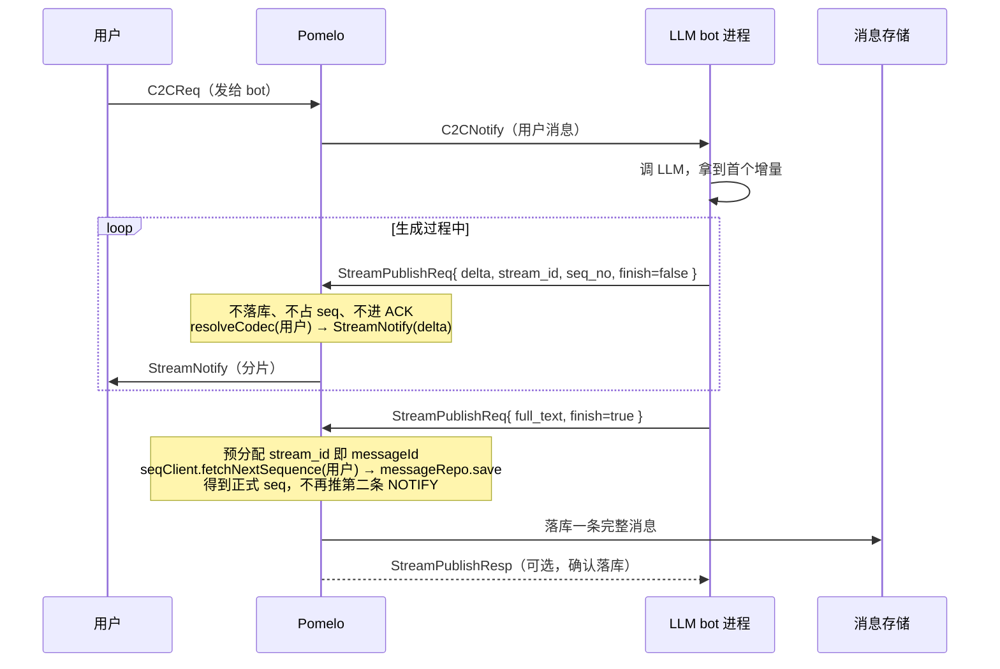

# LLM 流式回复（打字机效果）消息方案

> 日期：2026-09-03
> 状态：草案（待评审）
> 范围：Pomelo 服务端 + pomelo-web 前端 SDK

## 一、背景与目标

后续要接入大模型（LLM）：用户给某个"助手/bot 账号"发一条消息，服务端调用 LLM，
把回复内容**分片实时推**给用户，前端在**同一个气泡**里呈现打字机效果，而不是等整段
生成完一次性落一条消息。

传输层本身是 WebSocket 全双工长连接，天然支持流式，**不需要 HTTP SSE**。SSE 只是
HTTP 单向流的模拟手段。要解决的是协议与存储层面的问题：如何让"正在生成的分片"
区别于"已落库的正式消息"，且不破坏现有的 seq 水位、去重、ACK、历史拉取。

## 二、核心结论（先行）

1. **流式分片是瞬态推送，不是消息**。分片不落库、不占 seq、不做全量 ACK。
2. 用**专用 CMD + 专用处理分支**承载分片，绕开现有 `C2C_NOTIFY` 的去重 / ACK /
   lastSeq 推进语义（否则前端的 `_onMessageReceived` 会把同 id 分片直接去重吞掉）。
3. 生成结束后，把**完整文本作为一条正式 C2C 消息落库**（沿用现有 `doSend` 分配
   seq），且这条正式消息的 `messageId` = 流式期间预先分发的 id。前端据此把流式
   气泡"升级"为正式消息，历史/离线/重连语义全部复用现有 pull 通道，保持一致。

## 三、现状链路回顾（代码级）

### 3.1 服务端：一条消息全量走完

`C2CService.doSend()`（pomelo-logic-server .../service/C2CService.java:98）：

```text
snowflake.nextId()                          // 服务端消息 id
  → seqClient.fetchNextSequence(recipient)  // 收件人 inbox seq（写扩散水位）
  → messageRepo.save(record)                // 落库，status=0
  → publishC2CNotify(record)                // 组 PB/JSON push，PushRouter.push
```

推送按收件人 codec 组包（PB `C2CNotify` / JSON），`content` 还会过
`mediaUrlSigner.signContent(...)` 做媒体签名（文本原样返回）。整段逻辑是
**"落一条 → 推一条"**，天然没有"推一半"的中间态。

### 3.2 前端：notify 进 store 即按一条消息处理

`sdk/client.ts:_onMessageReceived()`（约 801 行）：

```text
归一化 body → IncomingMessage
  → 若 id 在 receivedMessageIds 里 → 丢弃（去重）
  → lastSeq 推进到 msg.seq
  → emit 'message'
  → 进入 receivedBuffer，200ms 批处理发 RECEIVED ack
```

`stores/useChatStore.onIncomingMessage` 再按 `id` 去一次重，按 `timestamp` 排序。
`MessageBubble` 按 `ChatMessage` 渲染。

### 3.3 由此得出的硬约束

| # | 现状行为 | 对流式的后果 |
|---|---------|-------------|
| 1 | 每消息一条 record + 一个 seq，pull 按 seq 增量 | 分片若各占一条 seq，水位/历史全乱 |
| 2 | 客户端按 `msg.id` 去重 | 同 id 分片只会留下第一片 |
| 3 | 每收一条自动 RECEIVED ack | 全量 ack 分片会打爆服务端 |
| 4 | 内容过 `MediaUrlSigner` | 流式纯文本不该走媒体签名路径 |
| 5 | `addMessage` 同 id 直接丢弃 | 收尾正式消息会被当作"重复"吞掉，无法替换流式气泡 |

**结论：不能复用 `C2C_NOTIFY` + ext 标记去硬塞流式**，需要一条独立的流式通道。

## 四、方案总览

| | 方案 A（推荐） | 方案 B（复用 notify + ext 标记） |
|---|---|---|
| 做法 | 新增 `CMD_STREAM_*`，分片走独立 push 分支 | 复用 `C2C_NOTIFY`，ext 里塞 `streamSeq/isEnd` |
| 去重/ACK/水位 | 独立语义，互不污染 | 必须改 `_onMessageReceived` 的既有逻辑，风险高 |
| 未读数 | 流式不计数，收尾一条计一次 | 每片都触发 unread，需额外打标规避 |
| 收尾一致性 | 正式消息同 id，气泡升级 | 语义纠缠，升级逻辑与去重打架 |
| 落地成本 | 需注册新 cmd（服务端 + 前端各几处） | 前端需侵入核心接收路径打补丁 |

下面按**方案 A** 展开。

## 五、方案 A：专用流式 CMD（推荐）

### 5.1 协议扩展

在 `pomelo-common/src/main/proto/` 新增 `stream/stream.proto`：

```proto
syntax = "proto3";
package im.stream;
option java_package = "com.github.moxib.pomelo.proto.stream";
option java_outer_classname = "StreamProto";

// 流式分片（S→C 推给目标用户 / C→S bot 上行共用）
message StreamChunk {
  int64 stream_id   = 1;   // 流 id，即收尾正式消息将使用的 messageId（snowflake，服务端预分配）
  int64 sender_id   = 2;   // bot 用户 id
  int64 recipient_id = 3;  // 目标用户 id
  int32 seq_no      = 4;   // 0 起始的分片序号（客户端校验乱序/重复）
  string delta      = 5;   // 增量文本（打字机内容）
  string full_text  = 6;   // 仅 finish=true 时携带：完整文本（服务端落库用同一份）
  bool finish       = 7;
  string finish_reason = 8; // stop / length / error / user_cancel / disconnect
  int32 error_code  = 9;   // finish_reason=error 时的错误码
  int64 created_at  = 10;
  map<string, string> ext = 11; // 预留（如 model 名、tokens 统计）
}

// C→S：bot 上报一条分片（可选 RESP，实现期可再拆）
message StreamPublishReq {
  StreamChunk chunk = 1;
  string conversation_id = 2; // 校验归属（bot 只能对存在的会话发）
}
```

`common.proto` 的 `Cmd` 增加（取 0x00B0 段，避开已用的 0x00A0/0x00A1，且 < 256
满足 `ProtobufCodec` 的 Parser[256] 约束）：

```proto
CMD_STREAM_PUBLISH_REQ  = 0x00B0; // bot C→S 上行分片 / 收尾
CMD_STREAM_NOTIFY       = 0x00B1; // S→C 分片推送（目标用户）
```

> PB 与 JSON 双 codec 都要支持：服务端按收件人 codec 组包（复用
> `routeTable.resolveCodec` 模式）；pomelo-web 走 JSON codec，改动是类型层。
> 改完执行 `./mvnw protobuf:compile`，涉及 JS 端 PB 镜像时再跑
> `cd src/test/resources && npm run proto`。

### 5.2 生成端（LLM bot）接入形态

推荐：**bot 是一个普通账号，作为一个独立进程通过现有 WS 网关接入**（复用登录 /
session / 权限），只是它的 userId 被标记为 bot。它收到用户消息（现有 `C2C_NOTIFY`）
后去调 LLM，然后把 LLM 流式返回的每个增量用 `CMD_STREAM_PUBLISH_REQ` 上报：

```text
用户 --C2C--> pomelo --C2C_NOTIFY--> bot 进程
                                      bot 调 LLM（OpenAI/Anthropic 原生流式）
                                      bot 每拿到增量 --CMD_STREAM_PUBLISH_REQ--> pomelo
                                                                    (delta 一段 / 或合并多段)
                                      bot 最后一条 finish=true + full_text --> pomelo
                                      pomelo 落库正式消息(seq) --不再补推 NOTIFY-->
```

为什么 pomelo 要"多一层"而不是 bot 直连用户：会话归属、inbox seq、离线补拉、历史
一致性都收口在 pomelo。bot 是**生产者**，pomelo 是**通道 + 存储**。

> 备选：若未来 LLM 作为 pomelo 内置扩展（server-side 直接调 API），则只是把
> `CMD_STREAM_PUBLISH_REQ` 替换为服务内方法调用，下行 `CMD_STREAM_NOTIFY` 不变。

### 5.3 服务端数据流（核心时序）



服务端落点（新增 `StreamService`，复用现有依赖）：

```text
onPublish(chunk):
  if !finish: PushRouter.push(目标用户, CMD_STREAM_NOTIFY, chunk)   // 只推不存
  else:
    messageId = chunk.stream_id（即 snowflakeId，上行前已由 pomelo 下发）
    fetchNextSequence(recipient) → 组 MessageRecord（content=full_text）→ save
    // 落库成功即结束；不额外推 C2C_NOTIFY，避免与已打出的内容重复
```

- **仅当目标用户在线**才推分片（命中现有 session/route）；离线用户不推，收尾落一条，
  靠现有离线 pull（seq > lastSeq）拿到完整结果。
- 落库记录复用 `publishC2CNotify` 同款**正式消息结构**（id=snowflake、seq 有效），
  只是不再重复推送。
- 收尾动作由 `finish` 分片触发；若 bot 与 pomelo 断连且未收到 finish → 本次流作废
  （不落库），前端显示"生成中断"。

### 5.4 客户端语义

前端 `IMClient` 对 `CMD_STREAM_NOTIFY` **不进 `_onMessageReceived`**，走独立分支：

```text
dispatch(CMD_STREAM_NOTIFY)
  → 识别 stream 分组：key = recipientId + stream_id（即正式 messageId）
  → emit 'stream' 事件（delta / seq_no / finish / full_text / messageId）
  → 不更新 lastSeq、不进 receivedBuffer、不发 ACK
```

Store 侧约定（`useChatStore`）：

- 首片到达：以 `messageId` 作为 `ChatMessage.id`，新建**流式气泡**
  `{ status: 'streaming', timestamp: 流开始时刻(首片 createdAt), seq: 无 }`；
  气泡归属会话仍按 `senderId`（=bot）落到对应 peerId。
- 后续分片：同 id 找到该气泡，`content += delta`（纯 append，天然打字机节奏，
  若后端压太快可加前端微节流）。**不触发未读数、不产生新消息**。
- `finish=true`：用 `full_text` 覆盖 content，`status: 'streaming' → 正常态`，
  并发一次 RECEIVED ack（id 进现有 batch ACK）。此时气泡还**不落 seq**。
- 稍后该条正式消息经离线 pull / 历史拉取回来时：`addMessage` 的既有同 id 去重
  需要改为——**命中且现存是流式气泡 → 原地升级**（补 seq、保留已完成 content、
  清 streaming 标记）；**命中且现存已是正式气泡 → 丢弃**（现状行为）。这样重连、
  换设备都能收敛到同一条正式消息。
- 中途断连 / 收到 `finish_reason != stop`：气泡标注"已中断"，保留已出内容；待 pull
  补到正式消息（同 id）时升级，或让用户触发重生成。

### 5.5 前端改动落点

| 文件 | 改动 |
|------|------|
| `sdk/types.ts` | 新增 `Cmd.STREAM_NOTIFY`、`StreamChunk`、`ChatMessage.streaming?`、事件 `'stream'` |
| `sdk/client.ts` | `dispatch` 增加 `CMD_STREAM_NOTIFY` 分支；独立于 `_onMessageReceived` 的流式归并与 emit |
| `stores/useChatStore.ts` | `onStreamChunk`；`addMessage` 的"流式气泡升级"逻辑；`ChatMessage` 增加 `streaming` |
| `hooks/useIMClient.ts` | 桥接 `'stream'` → `useChatStore.onStreamChunk` |
| `components/MessageBubble` | `streaming` 态在文本末尾渲染光标 `▌`/`…`；其余类型不动 |
| `components/MessageList` | 流式期间随内容滚动到底 |

## 六、边界与错误处理

1. **长度 / 速率上限**：`delta` 累计有硬上限（如 64KB）；上行做频率限制，防 bot
   刷屏、防推流打爆在线用户。
2. **鉴权**：`CMD_STREAM_PUBLISH_REQ` 仅 bot 账号可发；`sender_id` 必须等于会话
   里真正的 bot；`conversation_id` 校验存在且归属正确。
3. **老客户端兼容**：不认识 `CMD_STREAM_NOTIFY` 的客户端忽略即可——收尾正式消息
   走 pull 仍能补齐，只是没有打字机效果。
4. **安全/内容消毒**：`content` 本就走文本渲染路径（非媒体），分片不经
   `mediaUrlSigner`；落库前再统一消毒一次（与现有一致）。
5. **收尾失败**：`save` 失败 → 回复 bot `error_code`，bot 可重试 finish 或放弃；
   客户端侧等 pull 收敛。

## 七、群聊（C2G）延伸（二期，不在本次范围）

LLM bot 若作为**群成员**：下行分片镜像到 `CMD_STREAM_*` 的群版本（或同 cmd + 会话
类型），fan-out 到群成员；收尾落群消息（`im_message_group`），复用群已读水位
（`useGroupStore.getLastReadSeq` / 群 ACK）。差异点：多接收方、已读语义、分片按成员
各自在线与否决定推不推。本方案先收敛在 C2C，群聊只留扩展位（proto 里
`sender_id/recipient_id` 已够用，会话类型用 ext 或独立字段表达）。

## 八、分阶段实施计划

### 阶段一：协议 + 服务端通路（P0，打通分片通道）
- [ ] `stream/stream.proto` 新文件；`Cmd` 加 0x00B0/0x00B1；`./mvnw protobuf:compile`
- [ ] `ProtobufCodec` 注册新 cmd；`MessageDispatcher.registerDefaultHandlers`
- [ ] `StreamService`：finish=false 只 push（PB/JSON 双组包）；finish=true 走
      `fetchNextSequence + save`（复用 `MessageServiceImpl.buildConversationId`）
- [ ] bot 上行处理：`CMD_STREAM_PUBLISH_REQ` handler，鉴权（仅 bot）
- [ ] 单测：push 不落库 / finish 恰落一条且带有效 seq / 离线只落库不推

### 阶段二：pomelo-web 客户端（P0，打字机可见）
- [ ] SDK 增加 `STREAM_NOTIFY` 分支与 `'stream'` 事件（含乱序/重发校验）
- [ ] store 流式气泡 + 升级逻辑 + ack；`useIMClient` 桥接
- [ ] MessageBubble streaming 光标；MessageList 跟随滚动
- [ ] vitest：分片聚合、同 id 升级、断线后 pull 收敛

### 阶段三：bot 端 + 联调（P0→P1）
- [ ] 一个 mock LLM bot（用现有 C2C 收用户消息，把文本按 chunk 上报）
- [ ] 端到端：浏览器 → 服务端 → mock bot → 服务端 → 浏览器的打字机链路
- [ ] 断连/重连、离线补拉、历史一致性场景验证

## 九、开放问题

1. 分片是 **delta 增量** 还是 **累计全文**？推荐 delta（省带宽），乱序用 `seq_no`
   排序、丢片用"重传或整段重打"兜底；若更看重简单，可改为每次传累计文本。
2. 是否需要给 bot 用户一种"流式状态"（typing 指示）推给发送方用户？可在
   `CMD_STREAM_NOTIFY` 首个分片前推一条轻量 start 消息承载。
3. 收尾是否需要给发送方（用户）一个 ACK_NOTIFY 型"已送达"回执？——现阶段认为
   用户看到的就是 bot 自己发的正式消息，沿用 C2C 的送达回执即可，不额外加。
4. 打字机节奏由谁控制：后端按 LLM 原始 token 节奏推（推荐，前端零节流最平滑），
   还是前端节流？取决于后续真实 LLM 的平均 token 速率，留到联调定。
