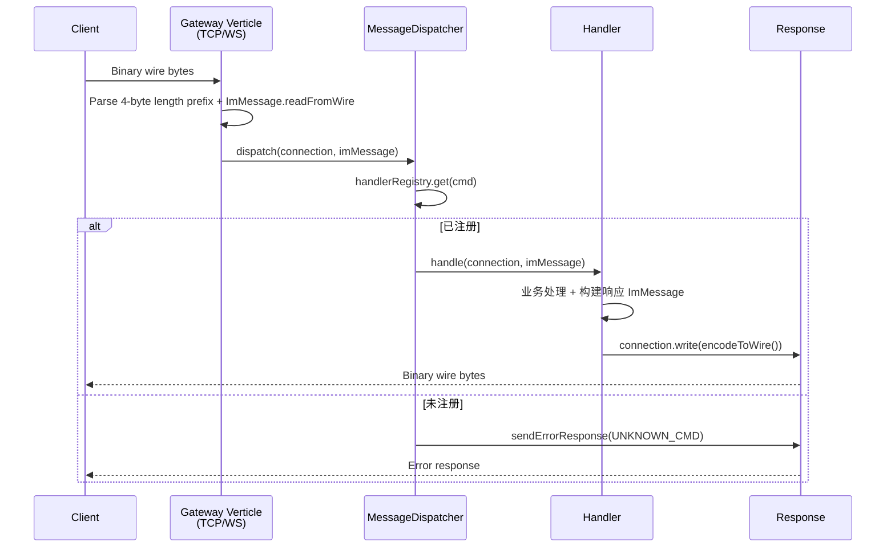
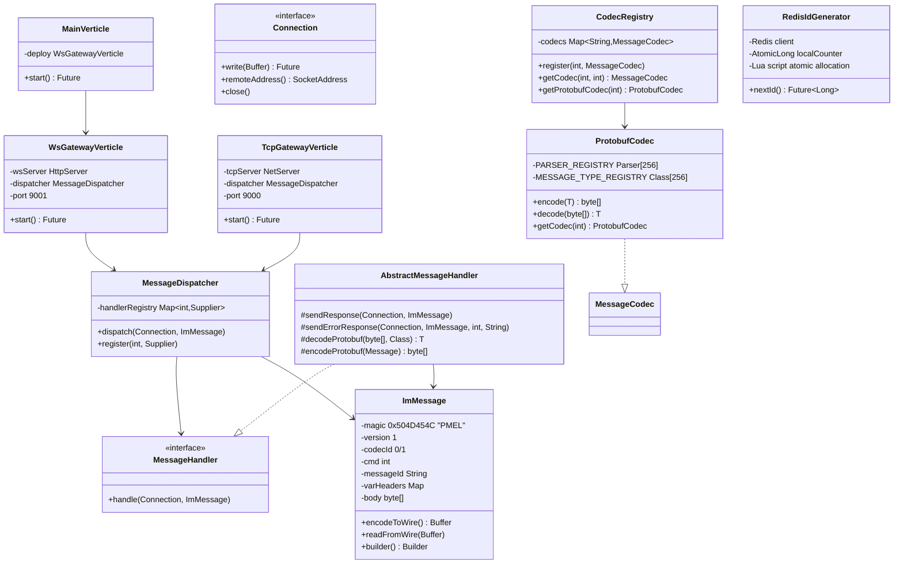

# Pomelo 即时通讯服务端 项目分析报告

> 分析日期：2026-07-15

---

## 1. 项目概要

| 属性 | 值 |
|------|-----|
| **项目名称** | Pomelo（柚子） |
| **坐标** | `com.github.moxib:pomelo:1.0.0-SNAPSHOT` |
| **代码仓库** | `https://github.com/moxib/pomelo` |
| **语言与运行时** | Java 17 |
| **核心框架** | Vert.x 5.0.8（响应式、非阻塞事件驱动） |
| **构建工具** | Maven（mvnw） |
| **通信协议** | 自定义二进制线协议，搭载 Protobuf 3.25.5 + JSON（Jackson）双编码 |
| **网络接入** | TCP（端口 9000）+ WebSocket（端口 9001）双网关 |
| **项目阶段** | **早期开发 / 骨架阶段**——协议层基本完成，业务处理器多为桩代码 |

项目由 Vert.x 项目生成器初始创建（`start.vertx.io`），在原始骨架之上构建了一套完整的 IM 通信协议栈与双网关基础设施。

---

## 2. 模块结构总览

```
src/
├── main/
│   ├── java/com/github/moxib/pomelo/
│   │   ├── MainVerticle.java                 # 应用入口，当前仅部署 WsGatewayVerticle
│   │   ├── common/
│   │   │   └── ImMessage.java                # ⭐ 核心：自定义线协议消息（编码/解码到 Buffer）
│   │   ├── codec/
│   │   │   ├── MessageCodec.java              # 编解码器接口（T → byte[]）
│   │   │   ├── CodecRegistry.java             # 编解码器注册表（cmd × codecId 二维路由）
│   │   │   ├── ProtobufCodec.java             # Protobuf 编解码器（静态 Parser 数组，零反射）
│   │   │   └── JsonCodec.java                 # JSON 编解码器（Jackson ObjectMapper）
│   │   ├── gateway/
│   │   │   ├── WsGatewayVerticle.java         # WebSocket 网关（端口 9001）
│   │   │   ├── TcpGatewayVerticle.java        # TCP 网关（端口 9000，含 RecordParser 粘包处理）
│   │   │   └── handler/
│   │   │       ├── Connection.java            # 统一连接抽象（NetSocket / ServerWebSocket）
│   │   │       ├── MessageHandler.java        # 消息处理器接口
│   │   │       ├── AbstractMessageHandler.java # 处理器基类（含 Protobuf 编解码辅助）
│   │   │       ├── MessageDispatcher.java      # ⭐ 消息分发器（cmd → Handler）
│   │   │       ├── HeartbeatHandler.java       # 心跳：Ping → Pong
│   │   │       ├── LoginHandler.java           # 登录（桩）
│   │   │       ├── LogoutHandler.java          # 登出（桩）
│   │   │       ├── C2CMessageHandler.java      # 单聊（桩，返回固定成功）
│   │   │       ├── C2GMessageHandler.java      # 群聊（空实现）
│   │   │       ├── CtrlReqHandler.java         # 控制命令（半桩，解码 Protobuf 后返回成功）
│   │   │       └── AckReqHandler.java          # ACK 确认（半桩，解码后返回成功）
│   │   ├── proto/                              # Protobuf 生成的 Java 类（由 protobuf-maven-plugin 生成）
│   │   └── utils/
│   │       ├── IdGenerator.java                # ID 生成器接口（tryInit + nextId）
│   │       └── RedisIdGenerator.java           # Redis 分布式 ID 生成器（Lua 脚本原子分配）
│   └── proto/                                  # Proto 源文件（8 个领域包）
│       ├── common/common.proto                 # Cmd 枚举、MsgType 枚举、AckType 枚举、MessageContent
│       ├── auth/auth.proto                     # AuthReq/Resp、LogoutReq/Resp
│       ├── chat/chat.proto                      # C2CReq/Resp/Notify
│       ├── group/group.proto                   # C2GReq/Resp/Notify
│       ├── ctrl/ctrl.proto                     # CtrlReq/Resp/Notify、CtrlType 枚举
│       ├── heartbeat/heartbeat.proto            # Ping/Pong
│       ├── ack/ack.proto                       # AckReq/Resp/Notify
│       ├── pull/pull.proto                     # PullReq/Resp
│       └── message/message.proto               # 统一 MsgBody（oneof 封装所有消息类型）
└── test/
    ├── java/com/github/moxib/pomelo/
    │   ├── TestMainVerticle.java               # 启动冒烟测试
    │   ├── common/ImMessageTest.java            # 线协议 8 项测试（含中文、空体、无效魔数）
    │   ├── codec/ProtobufCodecTest.java         # 所有 Proto 消息全量编解码测试
    │   ├── codec/JsonCodecTest.java             # JSON 编解码完整测试
    │   ├── gateway/TcpGatewayVerticleTest.java  # TCP 集成测试（6 项：连接、心跳、登录、聊天、未知命令、粘包）
    │   └── utils/RedisIdGeneratorTest.java      # Redis ID 生成器测试（Testcontainers）
    └── resources/
        ├── websocket-test.html                  # WebSocket 手动测试工具（浏览器用）
        └── logback-test.xml
```

---

## 3. 架构设计

### 3.1 消息流转



### 3.2 自定义线协议 (ImMessage)

```
+------+---------+---------+------+---------+----------+------+------+
| 4B   | 1B      | 1B      | 4B   | var     | var      | 4B   | var  |
| len  | magic   | version | codec| cmd     | msgId    | hdr  | body |
|      | "PMEL"  |         | Id   |         |          | cnt  | len  |
+------+---------+---------+------+---------+----------+------+------+
                                           | keyLen | key | valLen | val | ...
```

- **magic** = `0x504D454C`（ASCII "PMEL"）
- **version** = `1`（唯一支持的协议版本）
- **codecId**：`0`=Protobuf, `1`=JSON
- **cmd**：命令字（32 位整数，取值范围 0x0000–0xFFFF）
- **varHeaders**：字符串键值对映射（长度前缀编码）
- **body**：根据 codecId 解释的字节负载

### 3.3 命令字枚举 (Cmd)

| 分组 | Cmd | 值 | 方向 | 处理器状态 |
|------|-----|-----|------|------------|
| 认证 | `CMD_AUTH_REQ` | 0x0001 | C→S | ✅ LoginHandler（桩） |
| | `CMD_AUTH_RESP` | 0x0002 | S→C | — |
| | `CMD_LOGOUT_REQ` | 0x0003 | C→S | ✅ LogoutHandler（桩） |
| | `CMD_LOGOUT_RESP` | 0x0004 | S→C | — |
| 单聊 | `CMD_C2C_REQ` | 0x0010 | C→S | ✅ C2CMessageHandler（桩） |
| | `CMD_C2C_RESP` | 0x0011 | S→C | — |
| | `CMD_C2C_NOTIFY` | 0x0012 | S→C | — |
| 群聊 | `CMD_C2G_REQ` | 0x0020 | C→S | ⚠️ C2GMessageHandler（空实现） |
| | `CMD_C2G_RESP` | 0x0021 | S→C | — |
| | `CMD_C2G_NOTIFY` | 0x0022 | S→C | — |
| 拉取 | `CMD_PULL_REQ` | 0x0030 | C→S | ❌ 未注册处理器 |
| | `CMD_PULL_RESP` | 0x0031 | S→C | — |
| 控制 | `CMD_CTRL_REQ` | 0x0040 | C→S | ✅ CtrlReqHandler（半桩） |
| | `CMD_CTRL_RESP` | 0x0041 | S→C | — |
| | `CMD_CTRL_NOTIFY` | 0x0042 | S→C | — |
| 心跳/ACK | `CMD_PING` | 0x0050 | C→S | ✅ HeartbeatHandler |
| | `CMD_PONG` | 0x0051 | S→C | — |
| | `CMD_ACK_REQ` | 0x0052 | C→S | ✅ AckReqHandler（半桩） |
| | `CMD_ACK_RESP` | 0x0053 | S→C | — |
| | `CMD_ACK_NOTIFY` | 0x0054 | S→C | — |

### 3.4 组件关系



---

## 4. 技术评估

### 4.1 设计亮点

1. **线协议设计精良**：自定义二进制协议包含魔数校验、版本协商、变长头扩展、长度前缀帧格式——对于一个 IM 系统来说是正确的协议层抽象层次。

2. **双网关 + 统一连接抽象**：`Connection` 接口干净地封装了 `NetSocket` 与 `ServerWebSocket` 的差异，使上层处理器无需感知传输层。TCP 侧使用 `RecordParser` 正确解帧（处理粘包/半包），WS 侧天然帧定界。

3. **Protobuf 静态解析器注册**：使用 `Parser[256]` 数组按 cmd 索引，避免反射开销。所有 Proto 类型在 `static` 块中按 `CMD_*_VALUE` 常量注册——编译期即可检查遗漏，查找 O(1)。

4. **Proto 层级组织合理**：按领域（auth/chat/group/ctrl/ack/pull/heartbeat）拆分 proto 文件，`message.proto` 用 `oneof` 提供统一的 `MsgBody` 封装——适合后续的服务间 RPC 场景。

5. **Redis 分布式 ID 生成器**：参考 Redisson 的 segment 预分配 + Lua 原子操作设计，本地 `AtomicLong` 批量消耗，减少网络往返。

6. **测试覆盖有层次**：单元测试覆盖线协议和编解码器，集成测试覆盖 TCP 网关端到端（包括粘包），Testcontainers 用于 Redis 测试，另有 WebSocket 手动测试工具。

### 4.2 当前局限与待完善

| 领域 | 问题 | 影响 |
|------|------|------|
| **业务处理器** | 大多为桩/空实现，无实际业务逻辑 | 无法上线 |
| **会话管理** | 无用户连接映射、无状态维持 | 无法做消息路由/转发 |
| **消息持久化** | 无存储层集成 | 无法离线消息/历史记录 |
| **认证体系** | LoginHandler 不验证 token | 安全缺失 |
| **MainVerticle** | 仅部署 WsGateway，未部署 TcpGateway | TCP 网关无法自动启动 |
| **CmC2G** | C2GMessageHandler.handle() 为空方法体 | 群聊请求静默失败 |
| **拉取处理** | `CMD_PULL_REQ` 未注册处理器 | 离线消息拉取不可用 |
| **编译** | `target/` 目录不存在，项目未编译 | 可能存在编译错误 |
| **资源泄漏** | TcpGateway 的 `RecordParser` 未在连接关闭时解绑 | 潜在内存泄漏 |
| **体长度** | Builder 的 `bodyLength` 需手动设置 | 易用性问题，易出错 |

### 4.3 架构风险

- **单机无状态到分布式**：当前网关实例间无共享状态（连接表、用户会话），扩展为多实例需要引入一致性哈希消息路由或外部会话存储。
- **Redis 强依赖**：`RedisIdGenerator` 在 Redis 不可用时无降级路径，所有消息生成将失败。
- **反射式 Protobuf 解码**：`AbstractMessageHandler.decodeProtobuf()` 使用 `Method.invoke()` 调用 `parseFrom`，抵消了 `ProtobufCodec` 无反射设计的优势。

---

## 5. 依赖清单

| 依赖 | 用途 |
|------|------|
| `vertx-core` (5.0.8) | 核心事件循环、Buffer、Net/HTTP Server |
| `vertx-launcher-application` | Fat JAR 启动器 |
| `vertx-junit5` | 测试集成（VertxExtension） |
| `vertx-redis-client` | Redis 响应式客户端 |
| `protobuf-java` (3.25.5) | Protobuf 运行时 |
| `protobuf-java-util` | Protobuf JSON 转换 |
| `jackson-databind` | JSON 编解码 |
| `slf4j-api` / `logback-classic` | 日志 |
| `junit-jupiter` (5.9.1) | 单元测试 |
| `testcontainers` | Redis 集成测试容器 |
| `os-maven-plugin` | 构建平台检测（protoc 分类器） |
| `protobuf-maven-plugin` (0.6.1) | 编译期 proto → Java 代码生成 |

---

## 6. 下一步建议

基于当前功能完整度，建议按以下优先级推进：

### P0 — 使项目可编译运行
1. 运行 `./mvnw clean compile` 确认无编译错误
2. 修复 `C2GMessageHandler` 空方法体（至少记录日志）
3. 注册 `CMD_PULL_REQ` 处理器

### P1 — 业务逻辑核心
1. **会话管理**：实现 user ↔ connection 映射表，支持查找在线用户
2. **认证流程**：验证 token，建立会话上下文
3. **消息路由**：C2C 消息解析接收方，查询会话表后 write 推送
4. **离线消息**：引入消息队列或数据库存储未送达消息

### P2 — 运维能力
1. 同时部署 TCP + WebSocket 两个网关
2. 连接数/消息量监控指标
3. 限流与连接数控制

### P3 — 分布式扩展
1. EventBus 集群（多 Verticle 实例通信）
2. 共享会话存储（Redis Cluster / Ignite）
3. 消息可靠性保证（ACK 机制完整实现）

---

## 7. 测试状况

```
Total test classes: 6
- TestMainVerticle             : ✅ 部署冒烟
- ImMessageTest                : ✅ 8 项，覆盖编解码/边界
- ProtobufCodecTest            : ✅ 全量 Proto 编解码
- JsonCodecTest                : ✅ JSON 编解码全量
- TcpGatewayVerticleTest       : ✅ 6 项，含粘包测试
- RedisIdGeneratorTest         : ✅ Testcontainers Redis
```

测试框架：JUnit 5 + Vert.x JUnit 5 Extension + Testcontainers。无持续集成配置可见。

---

*报告由项目源码静态分析生成，未涉及运行时行为分析。*
