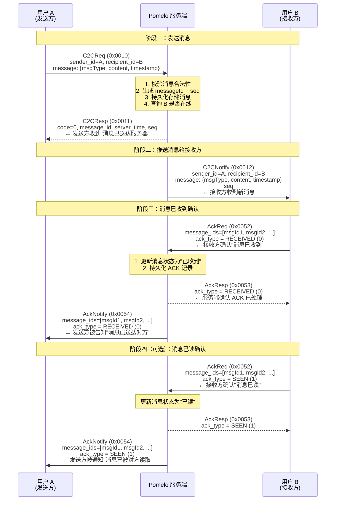

# C2C 单聊消息收发流程

## 参与者

| 角色 | 说明 |
|------|------|
| **用户 A** | 消息发送方 |
| **Pomelo 服务端** | IM 消息服务，负责存储、转发、确认管理 |
| **用户 B** | 消息接收方 |

## 协议消息

| Cmd | 方向 | 说明 |
|-----|------|------|
| `C2C_REQ` (0x0010) | C→S | 发送单聊消息请求 |
| `C2C_RESP` (0x0011) | S→C | 单聊消息发送响应（含 messageId、seq） |
| `C2C_NOTIFY` (0x0012) | S→C | 单聊消息推送（推送给接收方） |
| `ACK_REQ` (0x0052) | C→S | 消息确认请求（含 messageIds、ackType） |
| `ACK_RESP` (0x0053) | S→C | 消息确认响应 |
| `ACK_NOTIFY` (0x0054) | S→C | 消息确认推送（通知发送方消息已被接收/已读） |

## 完整流程

## AckType 说明

| 值 | 枚举 | 含义 | 触发时机 |
|----|------|------|----------|
| 0 | `RECEIVED` | 已收到 | B 的客户端收到消息后自动发送 |
| 1 | `SEEN` | 已读 | B 进入聊天界面查看消息后发送 |

## 关键设计要点

1. **C2CResp 不等于对方已收到** — 此响应仅意味着服务端已接收并存储了消息。此时 B 可能离线，消息会进入离线消息队列。
2. **双阶段 ACK** — `RECEIVED` 表示消息已推送到 B 的设备，`SEEN` 表示 B 已阅读。由业务层决定是否需要区分。
3. **AckNotify 是异步的** — ACK 通知是独立推送，与原始 C2CReq 不共享同一个事务或响应周期。
4. **seq 序列号** — 每个 C2C 会话（A↔B）各自维护单调递增的 seq，用于消息排序和断线重连时的增量同步。
5. **离线消息** — 如果 B 不在线，C2CNotify 跳过，消息存入离线队列。B 上线后通过 `PULL_REQ`/`PULL_RESP` 拉取。
