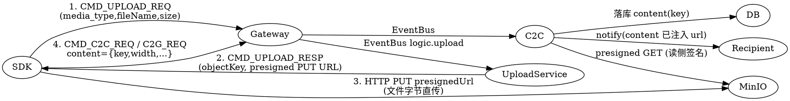

# 媒体消息设计（图片 / 自定义表情 / 视频 / 音频 / 文件）

- 日期：2026-08-27
- 状态：待评审
- 前置条件：`MsgType` 枚举已预留 IMAGE/VOICE/VIDEO/FILE/EMOJI；`im_message_c2c` / `im_message_group` 已预留 `content TEXT` + `msg_type SMALLINT`；docker-compose 已有 MinIO 兼容服务 `silo`

## 1. 背景与目标

当前 `MsgType` 枚举已定义 `IMAGE=2 / VOICE=3 / VIDEO=4 / FILE=5 / EMOJI=6`，消息表也已预留 `content` / `msg_type`，但 C2C / C2G 收发链路目前只实际处理 `TEXT=1`。目标是让客户端能发送图片、自定义表情、视频、音频、文件：

- SDK 先把文件上传到 MinIO 兼容对象存储（docker-compose 中已有的 `silo` 服务，S3 API 9002）
- 消息正文只携带「稳定 object key + 元数据」，不携带文件字节
- 服务端不走数据路径（不代理大文件）

## 2. 非目标（明确不做）

- 服务端图片处理（缩略图 / 转码 / 审核）— 缩略图由客户端自产自传
- 表情包目录 / 表情语义映射 — 自定义表情 = 一张图片 + `msgType=EMOJI`
- 消息撤回 / 过期清理、CDN 加速、秒传
- 服务端代理上传（客户端直传 MinIO）

## 3. 方案总览



## 4. 内容格式

媒体消息 `content` 为「字符串化 JSON」。字段：

| 字段 | 类型 | 说明 |
|---|---|---|
| key | string | 稳定 object key（落库主键，不随域名/签名变化） |
| thumb | string | 缩略图/封面 object key（可选） |
| width | int | 图片/视频宽（可选） |
| height | int | 图片/视频高（可选） |
| duration | int | 语音/视频时长 ms（可选） |
| size | int | 字节数（可选） |
| fileName | string | 原始文件名（FILE 建议必填） |
| format | string | 扩展名（如 jpg/mp4/m4a） |

落库示例（**只存 key，不存 url**）：

```json
{"key":"image/1001/20260827/8841234567890123456.jpg","width":1080,"height":1920,"size":102400,"format":"jpg"}
```

- `TEXT=1` / `SYSTEM=7` 保持纯文本原样，不进 JSON。
- 客户端发消息时传 `key` + 元数据；**`url` 由服务端在读侧注入**（见第 7 节）。

## 5. 上传流程（presigned PUT）

### 5.1 新增命令与消息

`common.proto` 的 `Cmd` 枚举新增：

```proto
CMD_UPLOAD_REQ  = 0x00A0;
CMD_UPLOAD_RESP = 0x00A1;
```

新增 `upload/upload.proto`：

```proto
message UploadReq {
  int32  media_type   = 1;  // MsgType: 2=image 3=voice 4=video 5=file 6=emoji
  string file_name    = 2;
  int64  size         = 3;
  string content_type = 4;  // MIME，可选
}

message UploadResp {
  int32  code          = 1;
  string message       = 2;
  string object_key    = 3;
  string presigned_url = 4;  // presigned PUT URL
  int64  expire_at     = 5;
}
```

`message.proto` 的 `MsgBody` oneof 增加 `upload_req = 70` / `upload_resp = 71` + import。

### 5.2 时序

1. SDK 发送 `CMD_UPLOAD_REQ`。
2. Gateway 经 `cmdToAddress` 路由到 `logic.upload`（EventBus）。
3. `UploadService`：
   - 从 session 取 userId（gateway 已 enrich），未认证则报错
   - 校验 `media_type ∈ {2..6}`、`size ≤ media.maxSizeBytes`、扩展名白名单
   - objectKey = `{type}/{userId}/{yyyyMMdd}/{snowflakeId}.{ext}`（Snowflake 保证不可预测）
   - 用 S3 presigner 生成 presigned PUT URL（TTL `media.putUrlTtlSeconds`）
4. SDK 收到 `objectKey` + `presigned_url`，直接 `HTTP PUT` 字节到 MinIO。
5. SDK 构造 `content` JSON（key + 元数据），走正常 C2C / C2G 消息发送。

### 5.3 S3 SDK

`pomelo-logic-server` 引入 `software.amazon.awssdk:s3`（含 `S3Presigner`），endpoint 指向 `media.endpoint`（如 `http://silo:9000`）。presign 为本地 HMAC 运算，无网络往返。

## 6. 发送与落库（读侧签名前）

- `C2CService.doSend` / `C2GService.doSend` / `MessageServiceImpl` / `PgMessageRepository.save` **均不改**。
- 媒体消息就是 `msgType=2..6`、`content=JSON字符串`，原样透传落库。落库的是 **key**（稳定），不含 `url`。

## 7. 下载访问控制（私有桶 + presigned GET）

- MinIO 桶**私有读**（禁止匿名读）。
- 服务端在**所有出站路径**把 `content` 里的 key 换成带 TTL 的 presigned GET URL。

### 7.1 签名器

```java
public interface MediaUrlSigner {
  // msgType ∈ {2..6} 且 content 可解析出 key：key→url、thumb→thumbUrl（presigned GET）
  // 其余（TEXT/SYSTEM、解析失败、无 key）原样返回
  String signContent(int msgType, String content);
}
```

实现 `MinioMediaUrlSigner`（依赖 S3 presigner + `media.*` 配置），同步方法：

- `key` → `url`（presigned GET，TTL `media.getUrlTtlSeconds`，默认 604800 = 7 天，S3 presigned 上限）
- `thumb` → `thumbUrl`（同样 presigned GET，可选）

### 7.2 注入点（8 处，4 服务 × PB/JSON 双分支）

| 服务 | PB 分支 | JSON 分支 |
|---|---|---|
| `C2CService.publishC2CNotify` | `:136` | `:164` |
| `C2GService.pushToGroupMembers` | `:175` | `:195` |
| `PullService.buildPullResp` | `:112` | `:150` |
| `GroupPullService` | `:114` | `:143` |

每处把 `record.getContent()`（或 `ctx.getContent()` / `m.getContent()`）替换为 `mediaUrlSigner.signContent(msgType, content)`。

`C2CService` / `C2GService` / `PullService` / `GroupPullService` 构造函数新增 `MediaUrlSigner` 依赖，`LogicVerticle` 统一实例化并注入。

### 7.3 URL 过期与客户端契约

presigned GET 有 TTL。历史消息的 url 过期后，客户端**重新拉取**（PULL / GROUP_PULL）即可获得新签名 URL；`key` 永久有效，不影响刷新。

客户端契约：

- 媒体下载过一次后**本地缓存**，历史回显优先读缓存，不重复走网络。
- 只有「首次查看某条媒体」才需要可用 url；url 过期时重新 PULL 刷新。
- 服务端每次下发（notify / pull）的 `url` 都是当场签好的最新链接，客户端无需自行用 `key` 换 url。

## 8. 数据模型

**零迁移。** `im_message_c2c` / `im_message_group` 的 `content TEXT` + `msg_type SMALLINT` 已足够；`content` 直接存 JSON 字符串（含 key + 元数据）。不新增列、不新增表。

## 9. 协议与编解码改动

| 文件 | 改动 |
|---|---|
| `pomelo-common/src/main/proto/common/common.proto` | `Cmd` 加 `CMD_UPLOAD_REQ/RESP` |
| `pomelo-common/src/main/proto/upload/upload.proto` | 新增 `UploadReq/UploadResp` |
| `pomelo-common/src/main/proto/message/message.proto` | `MsgBody` oneof + import |
| `ProtobufCodec` | 静态注册两个新 parser（cmd 值 160/161 < 256，走数组） |
| `MessageDispatcher.cmdToAddress` | `CMD_UPLOAD_REQ → "logic.upload"` |
| `LogicVerticle` | `logic.upload` consumer + 实例化 `UploadService`/`MediaUrlSigner` |

生成代码：`./mvnw protobuf:compile`（+ JS SDK `cd src/test/resources && npm run proto`）。

## 10. 组件改动清单

| 模块 | 文件 | 改动 |
|---|---|---|
| common | proto 三个文件 | 见第 9 节 |
| common | `ProtobufCodec` | 注册 upload parser |
| gateway | `MessageDispatcher` | 路由 + upload |
| logic | 新增 `UploadService` | presigned PUT 签发 + 校验 |
| logic | 新增 `infrastructure/MinioPresigner` | 封装 S3 presigner（put/get） |
| logic | 新增 `MediaUrlSigner` 接口 + `MinioMediaUrlSigner` 实现 | 读侧签名 |
| logic | `C2CService` / `C2GService` / `PullService` / `GroupPullService` | 注入 signer，8 处替换 |
| logic | `LogicVerticle` | 组装新依赖 |
| logic | `pom.xml` | 加 `software.amazon.awssdk:s3` |
| conf | `conf/config.yaml` | 加 `media.*` |

## 11. 配置项

```yaml
media:
  endpoint: http://silo:9000          # MinIO S3 API
  bucket: pomelo-media
  accessKey: pomelo-admin
  secretKey: pomelo-admin-password
  putUrlTtlSeconds: 300               # presigned PUT 有效期
  getUrlTtlSeconds: 604800            # presigned GET 有效期（7 天，S3 presigned 上限）
  maxSizeBytes: 104857600             # 单文件上限 100MB
  allowedExtensions: [jpg,jpeg,png,gif,webp,mp4,mov,mp3,m4a,aac,amr,pdf,zip]
```

可通过 `POMELO_MEDIA_*` 环境变量覆盖（沿用 `ConfigHolder` 约定）。`allowedExtensions` 建议按 `media_type` 再细分（如 voice 只允许音频）。

## 12. 安全与校验

- **身份**：`UploadService` 只给已认证 session 签发；未登录直接报错。
- **白名单**：`media_type`、扩展名/MIME 白名单；`size` 上限；objectKey 长度上限。
- **不可预测**：objectKey 用 Snowflake + 日期目录，避免遍历。
- **content 透传**：服务端不解析 client 发来的 content JSON 语义（只存不校验），但读侧签名时对「无法解析 / 缺 key」的媒体消息**原样返回并记 warn**（不 crash）。
- **私有读**：bucket 禁止匿名 GET；只有 presigned URL 能访问。

## 13. 错误处理

- 上传请求非法 → `CMD_UPLOAD_RESP{code≠0, message}`。
- presign 失败（MinIO 不可达）→ `CMD_UPLOAD_RESP` 报 500，客户端重试。
- 读侧签名失败 → 降级为「原样返回 content（仅 key，无 url）」+ warn，消息仍送达，客户端可稍后重拉。

## 14. 测试计划

| 层级 | 用例 |
|---|---|
| 单测 | `UploadService`：key 生成规则、media_type/size/扩展名校验、未认证拒绝（mock presigner） |
| 单测 | `MinioMediaUrlSigner`：media→注入 url、text→原样、缺 key/坏 JSON→原样 |
| 单测 | C2C/C2G/Pull/GroupPull 各补 `msgType=IMAGE` 用例，断言 content 透传 + url 注入 |
| 集成 | Testcontainers MinIO 起真实桶：presigned PUT 成功写入、presigned GET 成功读取、匿名 GET 拒绝 |
| 端到端 | 图片消息：上传→发→收（notify）→拉（pull）全链路，验证收端 content 含可用 url |

## 15. 未来工作（本次不做）

- 服务端缩略图/转码、内容审核
- 表情包目录、表情语义映射
- 对象生命周期（过期清理）、CDN 加速、秒传
- 消息撤回/已读后清理媒体
- 轻量重签命令（客户端已持有 key、url 过期时按批 key 换新 url，替代整页 PULL）
